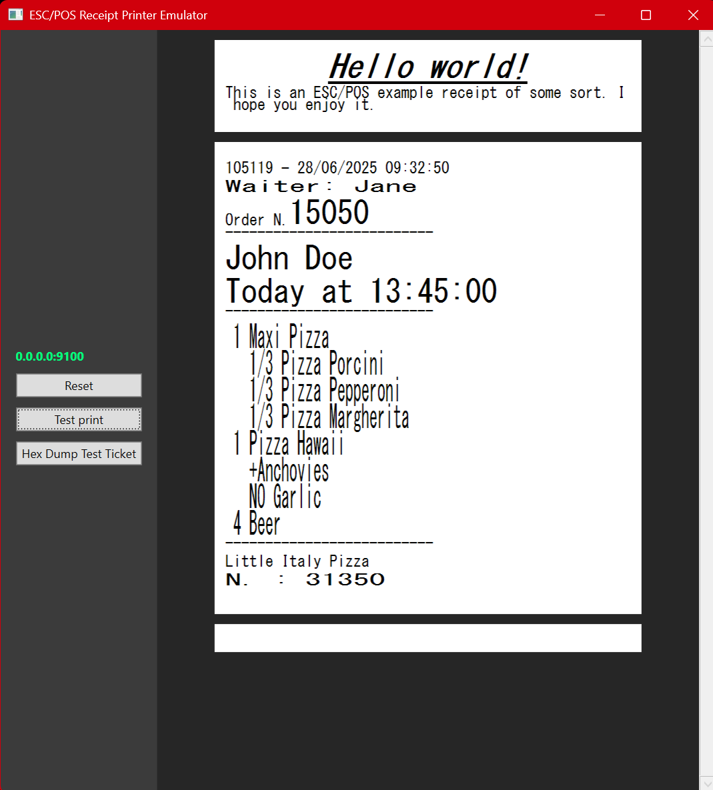

# ESC/POS Receipt Printer Emulator
🖨️ **This app emulates a networked receipt printer to test your ESC/POS commands against.**

### About
- Windows application (WPF + .NET 9)
- Binds to a TCP/IP interface and listens for ESC/POS commands
- Logs commands and visually represents the resulting receipt(s)
- It support different text formattings in the same line, although a few combinations were tested.

👷 **This is an unfinished experiment.** Use at your own risk and keep your expectations low. :)

### Supported commands

⚠️ Support is currently limited to only a subset of ESC/POS. Even the commands listed here may only be partially implemented.

- Raw Text
- LF: Line feed
- CR: Carriage return
- ESC Commands:
  - Initialize printer (`ESC @`)
  - Toggle italic (`ESC 4` / `ESC 5`) *[possibly deprecated?]*
  - Select font (`ESC M`)
  - Select charset (`ESC R`)
  - Select character table (`ESC t`)
  - Select justification (`ESC a`)
  - Select line spacing (`ESC 2` / `ESC 3`)
  - Toggle emphasis (`ESC E`)
  - Toggle underline (`ESC -`)
  - Set print text mode (`ESC !`)
  - Full cut (`ESC m`)
  - Partial cut (`ESC i`)
  - Print and feed n lines (`ESC d`)
  - Print and feed paper (`ESC J`)
- FS Commands:
  - Print stored logo (`FS p n m`)
  - Auto cut (`FS } 0x60 n`)
- GS Commands:
  - Select character size
  - Select cut mode and cut paper
  - Paper eject (`GS e n [m t]`)

### Example

### Emulated printer

This program emulates a printer with the following specifications:

 - 80mm paper width
 - 72mm printing width
 - 180x180dpi
 - ASCII Font A/B: 12x24 pixels
 - Automatic line feed
